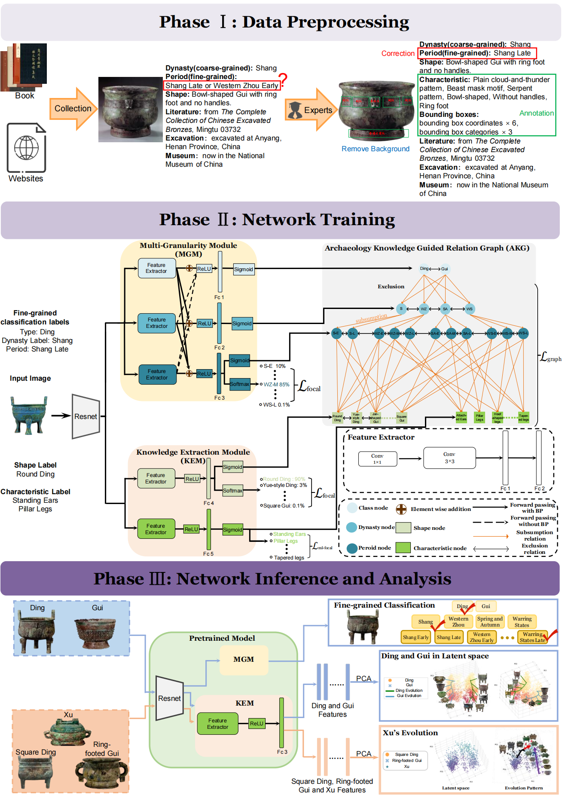

# Bronze-Ding-Gui
This repository contains the official implementation of our paper: **Reconstructing and interpreting the evolution of ancient relics with latent space**  

---

## 📘 Overview

This project provides the source code of our paper, which focuses on **bronze dating and analysis**. It implements a full training and evaluation pipeline built upon deep learning models, designed to handle **multi-granularity bronze dating**.

  

## 💾 Dataset Access

The dataset used in this work (including Ding and Gui bronze images and annotations) is part of an ongoing academic collaboration and **is not publicly released**.

